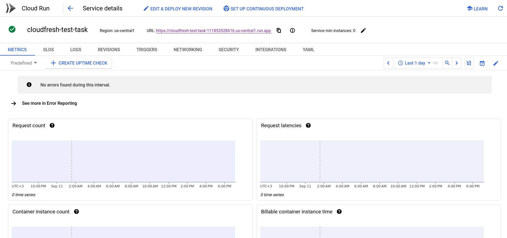
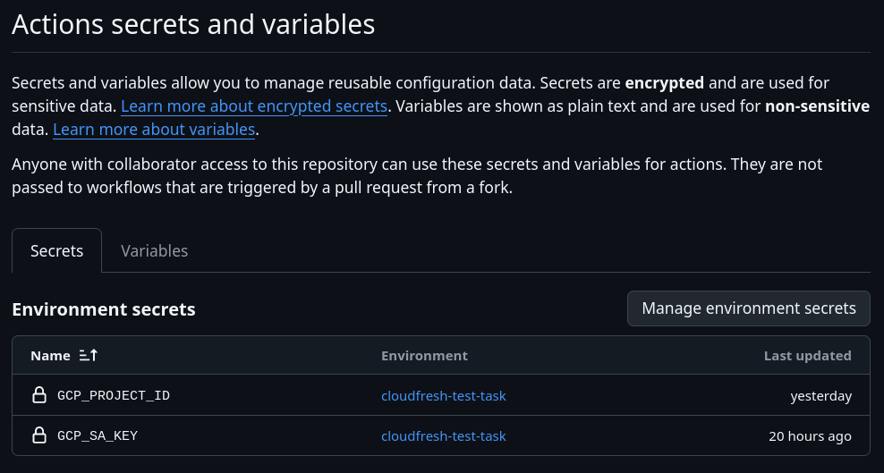
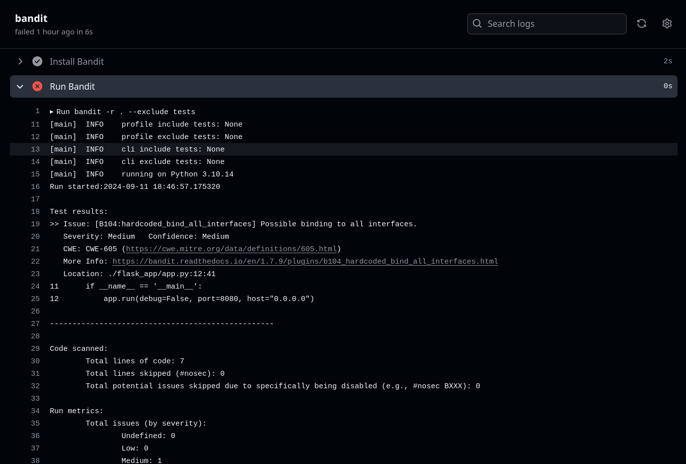

## Part 1: DevOps and DevSecOps

---

#### 1.1. Setup a CI/CD Pipeline
- First of all I created a very **minimalistic Flask application**. Nothing extra, as my goal is not to show off my web development skills.
- Next, I created a simple **СI pipeline** that starts working as soon as a push to the main branch takes place.
- For **CD pipeline**, I use the **Cloud Build** service, which is configured in the `cloudbuild.yml` file in the root directory. To configure the yaml file, I used the [documentation](https://cloud.google.com/run/docs/manually-set-up-continuous-deployment) with up-to-date information.
- In general, **each job in the CI/CD pipeline works independently of each other**. I think that this is not entirely correct, but unfortunately I did not have enough time to understand it fully, since I had almost no experience in this.
- Next, I deployed the project to **Cloud Run**, configured the trigger, connected the GitHub repository, and made other simple settings via the GUI.
    

#### 1.2. Implement Basic Security Measures
- First of all, there is no need to manually configure **HTTPS**, as it is all **done automatically in GCP**.
- Added **environment variables to .gitignore**. Added .env.sample for convenience, which will allow me to reproduce the environment variable structure.
- I don't have important information to keep in **github secrets**. But I added it when I tried to make CD according to outdated tutorials.
    
- For **static code analysis**, I use **Bandit** because it is easy to integrate into CI. Setup is very simple. I specified the entire repository as the directory to scan and added the `tests` directory to ignore. Launched by the command: `bandit -r . --exclude tests`.
    