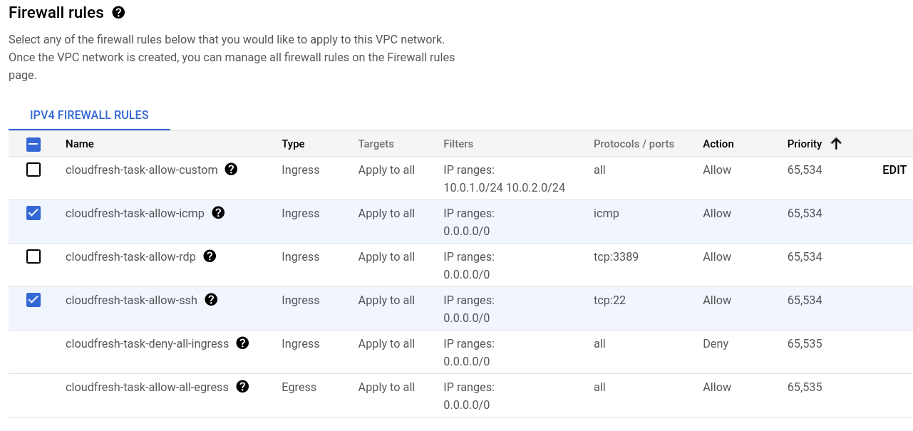
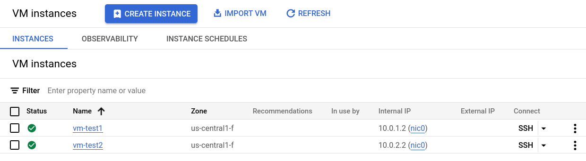
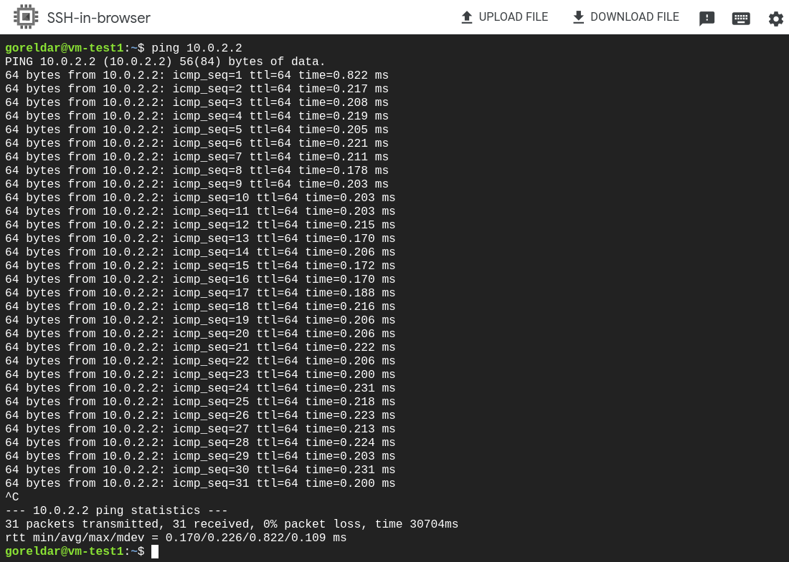
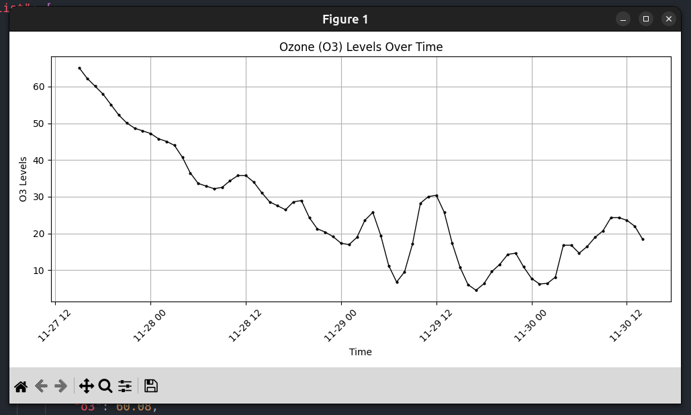

#### [Link for website](https://cloudfresh-test-task-111853528616.us-central1.run.app)

## Part 1: DevOps and DevSecOps

#### 1.1. Setup a CI/CD Pipeline
- First of all I created a very **minimalistic Flask application**. Nothing extra, as my goal is not to show off my web development skills.
- Next, I created a simple **СI pipeline** that starts working as soon as a push to the main branch takes place.
- For **CD pipeline**, I use the **Cloud Build** service, which is configured in the `cloudbuild.yml` file in the root directory. To configure the yaml file, I used the [documentation](https://cloud.google.com/run/docs/manually-set-up-continuous-deployment) with up-to-date information.
- In general, **each job in the CI/CD pipeline works independently of each other**. I think that this is not entirely correct, but unfortunately I did not have enough time to understand it fully, since I had almost no experience in this.
- Next, I deployed the project to **Cloud Run**, configured the trigger, connected the GitHub repository, and made other simple settings via the GUI.
    

#### 1.2. Implement Basic Security Measures
- First of all, there is no need to manually configure **HTTPS**, as it is all **done automatically in GCP**.
- Added **environment variables to .gitignore**. Added .env.sample for convenience, which will allow me to reproduce the environment variable structure.
- I don't have important information to keep in **github secrets**. But I added it when I tried to make CD according to outdated tutorials.
    
- For **static code analysis**, I use **Bandit** because it is easy to integrate into CI. Setup is very simple. I specified the entire repository as the directory to scan and added the `tests` directory to ignore. Launched by the command: `bandit -r . --exclude tests`.
    

## Part 2: Networking

#### 2.1. Network Configuration and Troubleshooting
- I created a VPC called `cloudfresh-task` and left all other settings at default.
- Next, I created a subnet called `subnet-1`, set the region: `us-central1` and the IP address: `10.0.1.0/24`. Repeated the same settings for the second subnet with IP address `10.0.2.0/24`.
- Next, in the **Firewall rules** section, I make settings to be able to use the `ping` command and remotely connect to the VM via `SSH`.
    
- Created two VMs in previously created VPC with the cheapest settings.
    
- Next, I SSH'd into `vm-test1` and checked if it was possible to communicate with `vm-test2`. In response, I received: `31 packets transmitted, 31 received, 0% packet loss, time 30704ms`
    
- Since I **correctly configured the firewall** from the very beginning, I did not encounter any errors.

## Part 3: Programming Skills

#### 3.1. Simple Automation Script
- Wrote a simple script using Python that **collects historical data on Air Population**, saves this data in the form of json and **visualizes the o3 level** using the **matplotlib**.
- To run this script, you need to create an **.env** file in the script directory, which contains the **API key** to the [service API](https://openweathermap.org/api/air-pollution).
- Then just run the command: `python3 script/script.py`
- JSON file you can find [here](script/data.json). And here is the visualization:
    

## Part 4: Creativity and Curiosity

#### 4.1. Project Proposal
First of all, I would take a closer look at CI/CD and fine-tuning the static code analyzer. I would try to do more automation using Teraform and add some kind of monitoring tool. It would also be interesting to try to integrate a tool that notifies the messenger about pull requests and pushes. Also, I would improve work with git, since my commits are very chaotic and I don't use branches and best practices.

Regarding the application itself. If there was more time, I would start implementing my pet project, which consists in the minimalistic study of English words. Something like a flash card, only in a very minimalistic way and with the ability to generate flash cards on a certain topic using LLM. In the beginning, this application would work as a Telegram bot, with further development for the web.

*Thank you for the test task, I gained new skills and got a better understanding of where I should go.*